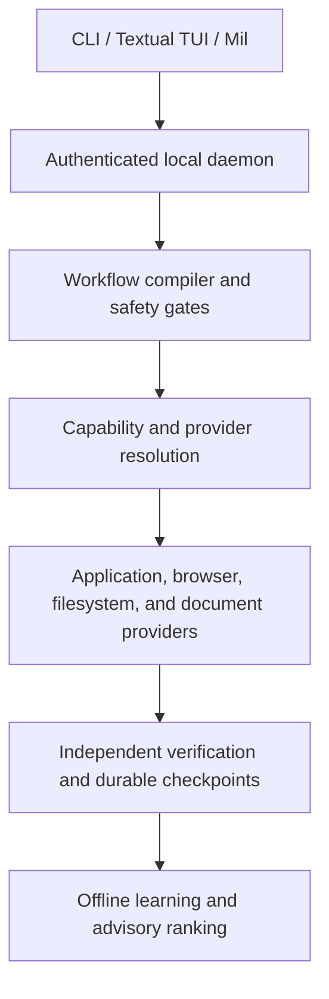

# MLLminal

MLLminal is a private, local workflow-intelligence system that learns how you work across your computer and turns recurring, approved behavior into safe, inspectable automation.

It is application-agnostic: MLLminal is not an Excel automation product or an Outlook automation product. It provides bounded capabilities for applications, browsers, files, and documents through one local daemon. Mil is the conversational interface; the CLI and Textual TUI are the dependable control surfaces.

## What MLLminal does

When you explicitly enable observation, MLLminal records minimized metadata about approved activity. It can then help you:

- discover available application capabilities;
- learn repeatable workflows from demonstrations;
- move structured information between applications;
- organize and transform files inside an attached workspace;
- generate reports and create drafts without sending them;
- execute bounded multi-application workflows after permission and approval;
- recover after interruptions from durable checkpoints;
- explain what happened, which policy was used, and why;
- improve provider ranking from verified outcomes through offline learning.

Workflows are represented as typed capabilities. Actions remain permission- and approval-controlled, effects are independently verified, and recovery or rollback is used where a provider can support it. Observation has no execution authority.

## How it works



The runtime follows this sequence:

1. Observe approved behavior.
2. Identify a reusable workflow.
3. Propose a typed plan.
4. Request permission and approval.
5. Select an eligible provider.
6. Execute bounded actions.
7. Independently verify the effects.
8. Checkpoint the result and learn only from verified outcomes.

The deterministic safety path remains authoritative. A learned policy can advise ranking or suggestions, but it cannot introduce an ineligible action, bypass approval, weaken permissions, suppress verification, promote itself, or retrain during execution.

## Product status

MLLminal is a technical preview. The categories below describe the current boundary honestly.

### Implemented

- Local authenticated daemon with SQLite persistence and Alembic migrations.
- `mllminal` CLI, Textual TUI, and Mil interactive terminal.
- Typed workflows, permissions, approvals, emergency stop, execution checkpoints, verification, and recovery paths.
- Bounded filesystem, application, browser-bridge, and manual-handoff capability contracts.
- Metadata-only Windows observation with privacy exclusions and explicit consent.
- Local Ollama/Qwen provider support plus deterministic fixtures.
- Offline training, evaluation, explicit policy promotion/rollback, backend ranking, suggestion ranking, and decision provenance.
- Per-user Windows installer, repair, upgrade migration backups, data-retaining uninstall, and explicit data purge command.

### Optional

- Ollama and a locally installed Qwen model for conversational planning.
- Launch-at-login daemon startup.
- Browser bridge and provider-specific adapters when explicitly configured and available.
- Local MLflow tracking and DuckDB/Parquet replay analysis for learning workflows.

### Experimental

- Windows UI Automation and native observer adapters across unfamiliar applications.
- Learned advisory ranking in live runtime decisions. Deterministic eligibility and safety checks still decide what may execute.
- Recovery and rollback for providers whose effects can be independently checked.

### Deferred

- Broad, universal application compatibility.
- Signed release distribution and a clean-machine certification matrix.
- Rich provider-specific document semantics beyond the bounded capability contracts.
- Automatic workflow discovery from unrestricted screen or content capture.

### Unsupported

- Credential, password, cookie, token, private-key, secure-field, clipboard, microphone, camera, or unrestricted screen capture.
- Unrestricted shell, PowerShell, CMD, Python, SQL, or arbitrary URL execution.
- Automatic email sending, form submission, purchasing, or other external submission.
- Cloud execution or online model training during live execution.

## Technology and why it exists

- **SQLAlchemy 2 + Alembic** provide durable typed database access and safe, versioned schema migrations.
- **SQLite** keeps workflow, policy, approval, execution, profile, and session state local and recoverable without a hosted database.
- **PyTorch** trains offline advisory policies and runs bounded local inference for promoted artifacts.
- **scikit-learn** supplies preprocessing, evaluation, calibration, clustering, drift analysis, and lightweight classical ML baselines.
- **LangGraph** is an optional way to structure Mil reasoning flows; it never becomes the execution authority.
- **Ollama + Qwen** provide local conversational reasoning and structured plan generation without sending prompts to a hosted model.
- **MLflow** records local experiments, candidate comparisons, and policy provenance so promotion decisions are inspectable.
- **DuckDB + Parquet** make local replay datasets and offline analysis efficient without changing the authoritative SQLite state.
- **FastAPI** exposes authenticated daemon contracts; **Typer** provides stable CLI commands; **Textual** provides the keyboard-first TUI.

## Safety and privacy

MLLminal is local-first. No MLLminal cloud offloading occurs: data and model execution stay local. Observation is disabled until explicitly enabled. There is no password or credential capture; cookies, tokens, private keys, secure fields, clipboard contents, raw typed text, pixels, audio, and camera input are excluded.

There is no unrestricted shell execution, automatic email sending, automatic form submission, purchasing, or online model training during live execution. Policies are never automatically promoted. Deterministic safety filtering runs before learned ranking, the emergency stop remains authoritative, and every consequential effect requires independent verification.

The local daemon is authenticated even on loopback. Data and model artifacts remain under the user’s local MLLminal directories. The default uninstall keeps that data; an explicit, confirmed purge removes only MLLminal-owned `data` and `backups` directories, never user-created files outside them.

## Windows installation

The normal-user flow is intentionally short:

1. Download the Windows setup executable.
2. Double-click it and keep the safe per-user defaults.
3. Optionally open Advanced options for launch-at-login or a desktop shortcut.
4. Click Install and wait for the Ready page.
5. Close setup at the Ready page, then open MLLminal, Mil, MLLminal Terminal, or MLLminal Diagnostics from the Start Menu.

The setup executable includes the daemon, CLI, Textual TUI, Mil, Python runtime, dependencies, migrations, shortcuts, and uninstall support. Users do not need Python, `uv`, Git, a source checkout, or manual environment variables. Mutable data lives outside the application directory.

## Upgrade, repair, and uninstall

Run the same setup executable again to repair the current installation or update it to a newer version. Setup stops only MLLminal-owned processes, backs up SQLite state before migrations, and preserves durable user state. Mil, the TUI, and CLI commands perform bounded daemon readiness when opened. The setup supports unattended install with `/VERYSILENT /NORESTART`.

Windows Settings -> Apps -> MLLminal -> Uninstall opens the normal uninstaller. It removes installed binaries, shortcuts, the PATH entry MLLminal added (while preserving pre-existing PATH entries), startup registration, owned browser-host registration, and owned processes. Local MLLminal data is kept unless you explicitly select deletion. Silent uninstall keeps data by default.

To purge retained local state separately, use the explicit confirmation command:

```powershell
mllminal install purge-data --confirm MLLMINAL
```

Only MLLminal-owned local state is targeted; user-created documents, spreadsheets, PDFs, downloads, reports, and workflow outputs outside those directories are not deleted.

For troubleshooting after installation, run `mllminal doctor` in a new terminal. The Start Menu Diagnostics shortcut runs `mllminal doctor --json` without opening a shell window and records JSON at `%LOCALAPPDATA%\\MLLminal\\diagnostics\\doctor-shortcut.json`. Lifecycle commands include `mllminal status`, `mllminal service status`, `mllminal install status`, `mllminal install repair`, and `mllminal install data-path`.
## Developer installation

Developer installation is separate from the user installer and requires Python 3.12 and `uv`:

```powershell
git clone https://github.com/Israelobuk/mllminal.git
cd mllminal
uv sync --all-groups
uv run mllminal doctor
uv run mllminal mil
```

The local Qwen provider is optional. For it, run Ollama separately and configure a local model:

```powershell
ollama serve
ollama pull qwen3:4b
uv run mllminal models use qwen
uv run mllminal models status
uv run mllminal models test
```

For deterministic fixtures and tests, use `uv run mllminal models use deterministic`.

## CLI examples

```powershell
mllminal status --json
mllminal doctor
mllminal mil
mllminal applications discover <application>
mllminal capabilities list
mllminal workflows list
mllminal executions watch <id>
mllminal approvals list
mllminal emergency-stop
mllminal tui
```

Readable output is the default; commands that project daemon state support `--json` for scripts. Consequential operations remain authenticated, idempotent, approval-gated, and daemon-owned.

## Troubleshooting

- If a command cannot find the daemon, open a new terminal after installation and run `mllminal doctor`; `doctor`, Mil, and the TUI start the bundled daemon when needed.
- If Qwen is unavailable, start Ollama, confirm `qwen3:4b` is installed, or switch to deterministic mode for local fixtures.
- If an upgrade reports an unsafe database revision, restore the latest backup under the MLLminal backups directory and use the matching installer version; do not force a downgrade.
- If an adapter is unavailable, inspect `mllminal capabilities list` and `mllminal diagnostics collect --json`. Unsupported applications degrade to bounded discovery or manual handoff.
- Use `mllminal emergency-stop` whenever an execution must halt immediately.

## Project status and limitations

MLLminal is a technical preview, not a production-certified automation platform. It has not been certified on every Windows build or clean machine, the installer is not yet code-signed, and application compatibility is not universal. Office-specific verification is not claimed; Excel and Outlook are examples of applications that may require provider-specific capability work rather than special product authority. Review every proposed plan and consequential effect.

Further engineering details, design records, and acceptance evidence live under [`docs/`](docs/). The root README stays focused on the product, its boundaries, and how to use it safely.